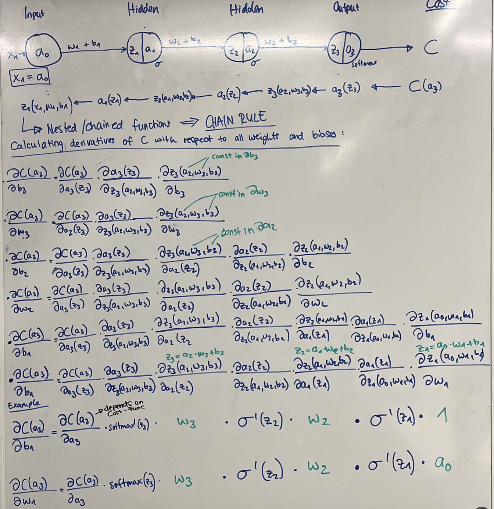

# Multilayer Perceptron

This project demonstrates the implementation of a neural network from scratch **without** any fancy ML libary to classify breast cancer data as benign or malignant. The training is based on a real [data set](https://www.kaggle.com/datasets/uciml/breast-cancer-wisconsin-data) provided by the University of Wisconsin.
It contains the following stpes:
- Data Preprocessing: Cleaning and Normalization
- Data Splitting: Split the Data into 3 substes of **train** and **validation** for the training process and **test** for testing the prediction
- Training: Tweak the parameters with Backpropagatio and gradient descent

***What is a Perceptron?***
A perceptron is a fundamental unit of a neural network. It mimics a biological neuron, receiving inputs, applying weights, summing them, and passing the result through an activation function.

## Preprocessing
The dataset has a slight imbalance of the B and M classes with ratio of 2:1, which is acceptable. No methods like oversampling or undersampling where applied. The subsets remain roughly the same class distribution. 

```python
---Result of data set split: ---
Train class distribution
        Total: 455
        B(0): 286 (62.9%)
        M(1): 169 (37.1%)

Validation class distribution
        Total: 56
        B(0): 37 (66.1%)
        M(1): 19 (33.9%)

Test class distribution
        Total: 58
        B(0): 34 (58.6%)
        M(1): 24 (41.4%)
```

## Training
The network is designed modular and the layer structure, the activation function and the cost function can be chosen. The model is trained using mini batch, which are shuffeled in each epoch to prevent pattern learning. 

### General network architecture
This image shows the general data flow from an input vector through the matrices (tensors) of the neural network. The connection from one layer to the next can be represented in a matrix because the input of node is the sum of the products of all nodes with their own weight. The bias of a layer can be represented be a simple column vecotr.

 

With result of the forward pass and the current values of all network parameters (weights and biases) we can calculate how good or bad the result is since we know the label of the passed data from our training dataset. This is done by using a Cost function (See later). We then want to find out how **every** parameter is affecting the cost. Since we want the minimal Cost for the best prediction we need to minimize it. Since the cost depends on every parameter, we need to find the **partial derivative** of the cost function with respect to every parameter in the network. With the partial derivatives we can use gradient descent to make a step towards the optimun as described here.

### Gradient descent
See [here!](https://github.com/alexehrlich/42Rio-AI-ft_linear_regression)

### Backpropagation
With backpropagation we can calculate every derivative of the cost function with respect to all the network parameters. With the derivative we can tweak every parameter with gradient descent. The following shows a simple one dimensional network and how to calculate the partial derivate of the cost function with respect to the parameters of the first layer. That way the error is ***backpropageted** through the net. It turns out that we can mulitply the error by the transposed matrix and then by the derivative of the acitvation function in order to send the error back through the network.


### Cost functions
A **cost function** measures the performance of a machine learning model by quantifying the error between predicted and actual outputs. It serves as the guiding metric to adjust the model's parameters (weights and biases) during training, with the goal of minimizing this error.

Some common cost functions include:

- **Mean Squared Error (MSE)**: Commonly used for regression tasks, it calculates the average squared difference between predicted and actual values.

  ```
  MSE = (1 / n) * Σ (y_i - ŷ_i)²
  ```

- **Cross-Entropy Loss**: Used in classification tasks, especially with probabilistic outputs like softmax, it measures the dissimilarity between predicted probability distributions and actual labels.

  ```
  L = -(1 / n) * Σ [y_i * log(ŷ_i)]
  ```

By minimizing the cost function during training, the model learns to make better predictions. Gradient descent and its variants are often employed to achieve this by iteratively updating model parameters.

## Usage
- `make setup` to install dependencies
- `make preprocess_data` to clean and normalize the data set
- `make train_classifier` to train the neural network with the train and validation subset
- `make prediction` to take the test subset and test the data


## Resources

- [Neural networks and deep learning](http://neuralnetworksanddeeplearning.com)
- [Gradient Descent, Step by Step (YouTube)](https://www.google.com/url?sa=t&source=web&rct=j&opi=89978449&url=https://www.youtube.com/playlist%3Flist%3DPLblh5JKOoLUIxGDQs4LFFD--41Vzf-ME1&ved=2ahUKEwjO9O-8vIGLAxVrXfEDHeycIhcQFnoECB0QAQ&usg=AOvVaw1-u2IIZQvYATQYMHEhaCWT)
  


