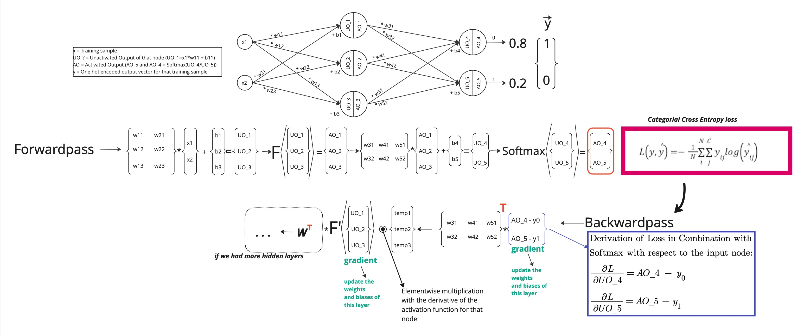

# Multilayer Perceptron (in progress)

This project demonstrates the implementation of a neural network from scratch **without** any fancy ML libary to classify breast cancer data as benign or malignant. The training is based on a real [data set](https://www.kaggle.com/datasets/uciml/breast-cancer-wisconsin-data) provided by the University of Wisconsin.
It contains the following stpes:
- Data Preprocessing: Cleaning and Normalization
- Data Splitting: Split the Data into 3 substes of **train** and **validation** for the training process and **test** for testing the prediction
- Training: Tweak the parameters with Backpropagatio and gradient descent


## Preprocessing
The dataset has a slight imbalance of the B and M classes with ratio of 2:1, which is acceptable. No methods like oversampling or undersampling where applied. The subsets remain roughly the same class distribution. 

```python
---Result of data set split: ---
Train class distribution
        Total: 455
        B(0): 286 (62.9%)
        M(1): 169 (37.1%)

Validation class distribution
        Total: 56
        B(0): 37 (66.1%)
        M(1): 19 (33.9%)

Test class distribution
        Total: 58
        B(0): 34 (58.6%)
        M(1): 24 (41.4%)
```

## Training
The network is designed modular and the layer structure, the activation function and the cost function can be chosen. The model is trained using mini batch, which are shuffeled in each epoch to prevent pattern learning. 

### General network architecture
This image shows the general data flow from an input vector through the matrices (tensors) of the neural network. The connection from one layer to the next can be represented in a matrix because the input of node is the sum of the products of all nodes with their own weight. The bias of a layer can be represented be a simple column vecotr.

 

With result of the forward pass and the current values of all network parameters (weights and biases) we can calculate how good or bad the result is since we know the label of the passed data from our training dataset. This is done by using a Cost function (See later). We then want to find out how **every** parameter is affecting the cost. Since we want the minimal Cost for the best prediction we need to minimize it. Since the cost depends on every parameter, we need to find the **partial derivative** of the cost function with respect to every parameter in the network. With the partial derivatives we can use gradient descent to make a step towards the optimun as described here.

### Backpropagation

### Gradient descent

### Cost functions

## Usage


## Neural Networks

### What is a Perceptron?  
A perceptron is a fundamental unit of a neural network. It mimics a biological neuron, receiving inputs, applying weights, summing them, and passing the result through an activation function.

### Neural Network Structure  
A neural network consists of layers of perceptrons (neurons), each with weights and biases. The network propagates data forward from input to output, learning patterns from data.  

*(Placeholder for neural network structure diagram)*

### Matrix and Vector Representation  
In a neural network, weights and biases are represented as matrices and vectors. During a forward pass, input data is multiplied with weights, added to biases, and transformed through activation functions.  

*(Placeholder for forward pass diagram)*

### Loss Functions  
Loss functions measure how well the neural network predicts the desired output. Examples include:  
- Mean Squared Error (MSE) for regression tasks  
- Categorical Cross-Entropy for classification tasks  

---

## Backpropagation

### Why?  
Backpropagation allows the network to learn by updating weights and biases based on the error between predicted and actual outputs. It calculates the gradient of the loss function with respect to each weight through reverse traversal of the network.

### What?  
Backpropagation combines:  
1. The **chain rule of calculus** to compute derivatives.  
2. Gradient descent to optimize weights iteratively.  

---

## Proof of Softmax in Combination with Categorical Cross-Entropy Loss  

The softmax function transforms raw scores (logits) into probabilities:
\[
\sigma(z_i) = \frac{e^{z_i}}{\sum_{j} e^{z_j}}
\]

When combined with the categorical cross-entropy loss:
\[
\text{Loss} = -\sum_{i} y_i \log(\sigma(z_i))
\]

Substituting the softmax equation:
\[
\text{Loss} = -\sum_{i} y_i \log\left(\frac{e^{z_i}}{\sum_{j} e^{z_j}}\right)
\]

Simplifies to:
\[
\text{Loss} = -\sum_{i} y_i \left(z_i - \log\sum_{j} e^{z_j}\right)
\]

Further derivations show that the gradients for this loss are simpler and computationally efficient.

*(Detailed calculations can be added here)*

---

## Resources

- [Gradient Descent, Step by Step (YouTube)](https://www.youtube.com/watch?v=sDv4f4s2SB8)

--- 
